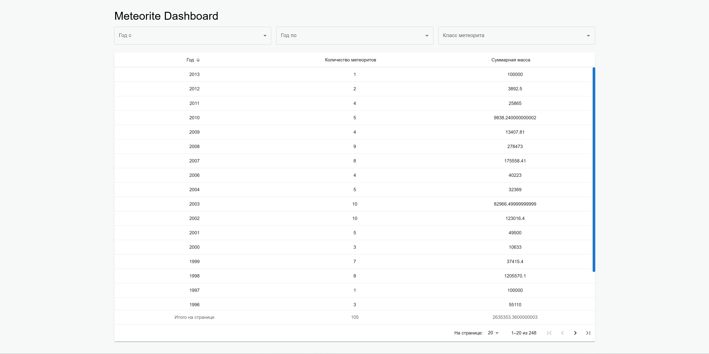
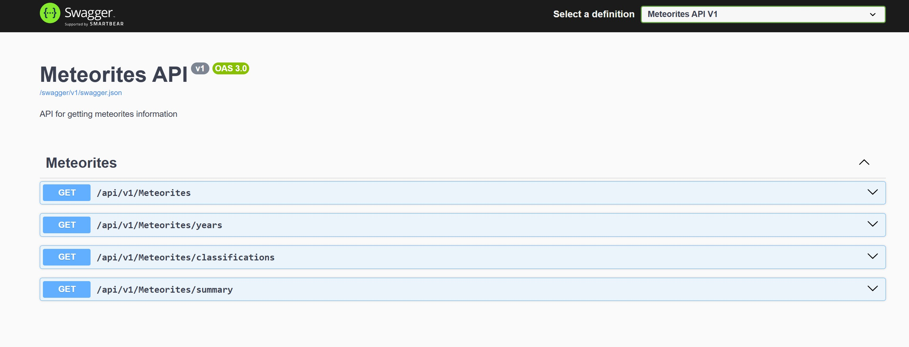
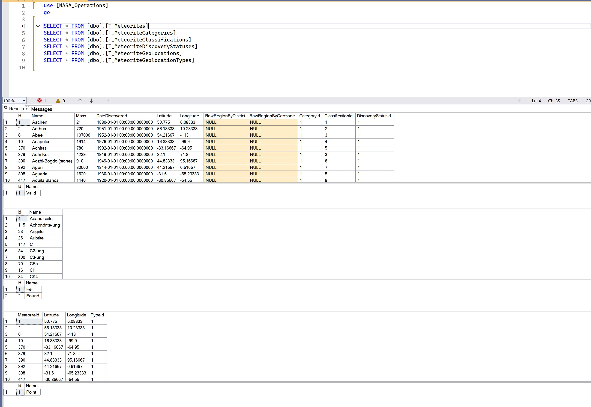

# Тестовое задание для компании AlreadyMedia

Автор: Шевяков Никита Александрович
Файл ТЗ: [technical_specification.pdf](./documents/technical_specification.pdf)

## Цели проекта
1. Сервис синхронизации данных о метеоритах
    - Периодически загружает JSON с удалённого источника
    - Сохраняет и обновляет данные в базе, с учётом добавлений, удалений и изменений
    - Обрабатывает ошибки и следует C# гайдлайнам
2. API с фильтрацией, группировкой и сортировкой
    - Фильтры: диапазон лет, класс метеорита, часть названия
    - Группировка: по году
    - Сортировка: по году, количеству, суммарной массе
3. Веб-страница для отображения данных
    - Таблица с фильтрами и сортировкой по всем колонкам
    - Реализована на React с использованием Material-UI и Redux Toolkit

## Интерфейс и структура
- UI интерфейс: 
- API архитектура:
- Структура базы данных: 

## Стек технологий
- Frontend: React, Material-UI, Redux Toolkit
- Backend: .NET Core API
- Архитектура: Чистая, модульная, масштабируемая